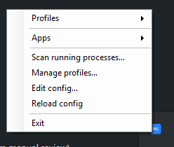

# BgToggle

A minimal Windows tray app that toggles groups of background programs on and off via named profiles. Designed for the case where you have 30–40 tray-resident apps (Spotify, Discord, Razer Synapse, OneDrive, AMD Adrenalin, NVIDIA stuff, etc.) and want a "Working" / "Gaming" / "Optimized" / "All off" switcher.



## What it does

- Loads a JSON config from `%APPDATA%\BgToggle\config.json` describing apps and profiles.
- Tray icon menu with two submenus:
  - **Profiles** — click a profile to apply it. The applier diffs current state against the target and only stops/starts what needs changing.
  - **Apps** — per-app toggle (checkmark reflects whether the process is currently running).
- For each app you can configure:
  - `killMethod`: `graceful` (WM_CLOSE → wait → force) or `force` (kill tree immediately).
  - `gracefulTimeoutMs`: how long to wait for graceful exit.
  - `autostart`: `registryRunUser`, `registryRun` (HKLM, needs admin), `startupFolder`, or `none`. When set, disabling the app also disables its autostart so it doesn't come back next boot. Enabling restores the original value from a stash key under `HKCU\Software\BgToggle\Stash`.

## Recipe-driven shutdowns

Every "background app" sits in roughly one of five buckets — graceful-cooperator, tray-trap, service-watchdog, multi-process, service-only-with-side-effects — and the right way to stop it depends on the bucket. That knowledge lives in a bundled `recipes.json` next to the binary, not in code.

`ShutdownStrategy` values:

- `graceful` — WM_CLOSE → wait → kill tree. For apps that honor close (Dropbox, Greenshot, f.lux).
- `killTree` — kill immediately, including children. For tray-trap apps that hide on WM_CLOSE (Discord, Slack, Teams) and for multi-process apps where the parent doesn't take its helpers down.
- `command` — invoke a CLI on the launch exe for a clean shutdown. OneDrive (`/shutdown`) and Steam (`-shutdown`) need this; force-killing them can leave files / download manifests inconsistent.
- `stopServiceOnly` — no UI process to kill, just stop services.
- `stopServiceThenKill` — service is the watchdog; stop it first, then kill the UI tree. For Razer Synapse, Logitech G HUB, Adobe Creative Cloud, Corsair iCUE, Armoury Crate, MSI Center, AnyDesk, TeamViewer, NordVPN, ProtonVPN.

A recipe also carries `servicesToLeaveAlone` — driver-tied services we should never touch (e.g. NVIDIA's `NvContainerLocalSystem`, AMD's `AMD External Events Utility`).

A user's `AppDefinition` becomes a thin reference: `{ "id": "spotify", "displayName": "Spotify", "recipeId": "spotify" }`. The recipe carries the global knowledge; the app definition carries personal config (install path override, which profiles to include in). When recipes update upstream, your config keeps working.

## Project layout

```
BgToggle/
├── BgToggle.csproj          .NET 8 + WinForms; ServiceController package
├── Program.cs               Entry point
├── TrayApp.cs               NotifyIcon + ContextMenuStrip
├── IconFactory.cs           Generates the tray icon at runtime (no .ico shipped)
├── Models.cs                AppDefinition / Profile / Config + AppResolver
├── Recipes.cs               Recipe / ShutdownStrategy / ResolvedApp records
├── ConfigStore.cs           JSON load/save for user config
├── RecipeStore.cs           JSON load + %ENV% expansion for recipes.json
├── ProcessManager.cs        Find / launch / stop, dispatches on ShutdownStrategy
├── ServiceManager.cs        Start/stop Windows services (needs admin to actually stop)
├── AutostartManager.cs      Registry Run + Startup folder, with stash/restore
├── ProfileApplier.cs        Diff + apply over ResolvedApp
├── RecipeScanner.cs         Match running processes against bundled recipes
├── ScanDialog.cs            Checklist UI for adding scanned apps to config
├── ProfileEditor.cs         Manage profiles UI (create / rename / delete + app checklist)
├── recipes.json             Bundled recipe library (50+ apps)
└── config.example.json
```

## Build & run

```
dotnet build
dotnet run
```

First run creates an empty config at `%APPDATA%\BgToggle\config.json` and loads recipes from `recipes.json` next to the exe. Use **Scan running processes…** to detect known apps and add them to the config; then **Manage profiles…** to define which apps each profile keeps running.

## Contributing recipes

Recipes are the most valuable thing this project can grow. If your favorite tray app isn't covered or has the wrong shutdown strategy on your machine, see [CONTRIBUTING.md](CONTRIBUTING.md) and [docs/RECIPES.md](docs/RECIPES.md). The [issue templates](.github/ISSUE_TEMPLATE/) collect the right info up front.

## What's still stubbed

1. **Hotkeys.** `RegisterHotKey` to bind `Win+Ctrl+1` → "Working", `Win+Ctrl+2` → "Gaming". A hidden message-only window receives `WM_HOTKEY`; a few dozen lines.
2. **Scheduled tasks autostart.** Not all autostart entries live in Run keys; many tray apps use scheduled tasks. `Microsoft.Win32.TaskScheduler` (NuGet) handles them.
3. **Elevation handling.** If a service stop or an autostart write needs admin and BgToggle isn't elevated, the operation logs and continues. Real fix: register BgToggle as a scheduled task at logon with "highest privileges" (silent auto-elevate), or split into a tray UI + a small SYSTEM-level helper service speaking over a named pipe. v1 path is the scheduled-task trick.
4. **Logging.** Errors go to `Debug.WriteLine` and the optional log callback in `ProfileApplier.Apply`. A rolling log file under `%APPDATA%\BgToggle\logs\` would help when something quietly fails.
5. **Profile transitions.** Switching profiles can stop a lot of apps with no warning. A "confirm before stopping N apps" dialog might be worth it for big diffs.
6. **Recipe contributions.** `recipes.json` is bundled today. Long term it could ship like uBlock filter lists or winget manifests.
7. **Logging.** Right now errors go to `Debug.WriteLine`, which is invisible outside a debugger. A rolling log file under `%APPDATA%\BgToggle\logs\` would help when something quietly fails to launch.
8. **Profile transitions.** If "Working" includes Spotify and "Gaming" doesn't, switching Working → Gaming will stop Spotify. Currently that happens with no warning. A "confirm before stopping N apps" dialog might be worth it for big diffs.
9. **Better matching.** `ExeName` matching catches all instances by process name. If two managed apps share an exe name (rare but possible), you'd need to disambiguate by full path.

## Design notes

- **Profile = set of app IDs that should be running.** Nothing more. The diff is computed from current OS state, not from the previously active profile, so it's robust against the user manually starting/stopping things between profile applies.
- **We only touch apps that are explicitly in the config.** A profile switch never kills a random `chrome.exe` the user opened. This is by design — the tool is opt-in per app.
- **Autostart is symmetric.** Disabling an app stashes its autostart value; enabling restores it from the stash. The stash lives in `HKCU\Software\BgToggle\Stash`. If you uninstall BgToggle while apps are "off", their autostart entries are still in the stash and won't fire — worth a cleanup-on-uninstall step eventually.
